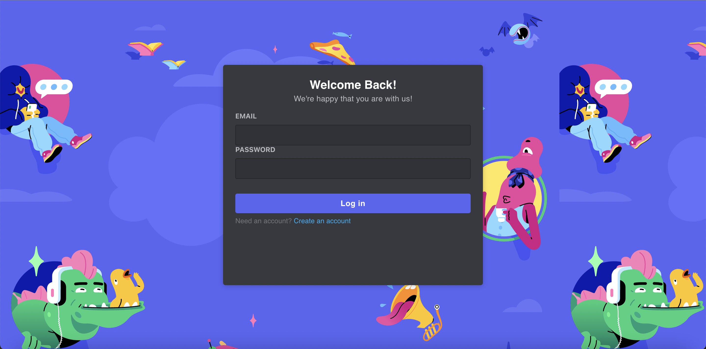
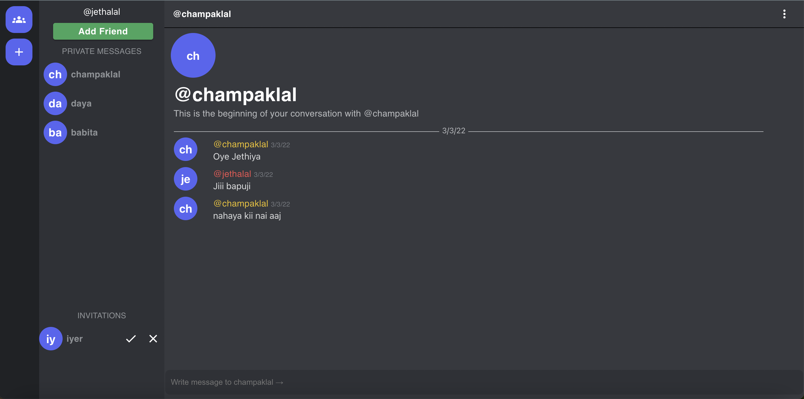

<div id="top"></div>
<div align="center">
  <h2 align="center">Discord Clone</h2>
  <p align="center">
    <a href="https://discord-dhanu.netlify.app/" target="_blank">View Demo</a>
    ·
    <a href="https://github.com/dhanu0510/discord-backend" target="_blank">Backend</a>
  </p>
</div>

  <h2>Table of Contents</h2>
  <ol>
    <li>
      <a href="#about-the-project">About The Project</a>
      <ul>
        <li><a href="#features">Features</a></li>
        <li><a href="#built-with">Built With</a></li>
      </ul>
    </li>
    <li>
      <a href="#getting-started">Getting Started</a>
      <ul>
        <li><a href="#installation">Installation</a></li>
      </ul>
    </li>
    <li>
        <a href="#screenshots">Screenshots</a>
    </li>
  </ol>

## Features

- User Authentication
  - Login
  - Register
- Invite Friends
- Create Channel
- Realtime Chat and Video Chat
- Screen Share


## Built With

- [MongoDB](https://www.mongodb.com/) (Mongo atlas)
- [Express.js](https://expressjs.com/) (Backend)
- [React.js](https://reactjs.org/) (Frontend)
- [Node.js](https://nodejs.org/) (Backend)
- [Redux](https://redux.js.org/) (Used for state management)
- [socket.io](https://socket.io/) (Used for real-time chat)
- [webRTC](https://webrtc.org/) (Used for video chat)

<p align="right">(<a href="#top">back to top</a>)</p>

## Installation

1. Clone the repo
   ```sh
   git clone https://github.com/dhanu0510/discord-frontend.git
   ```
2. Install NPM packages
   ```sh
   npm install
   ```
3. Run the server
   ```sh
   npm start
   ```

<p align="right">(<a href="#top">back to top</a>)</p>

## Screenshots

<div>
    
    <br/>
    
</div>
